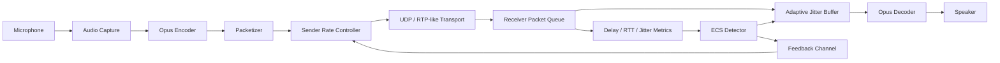
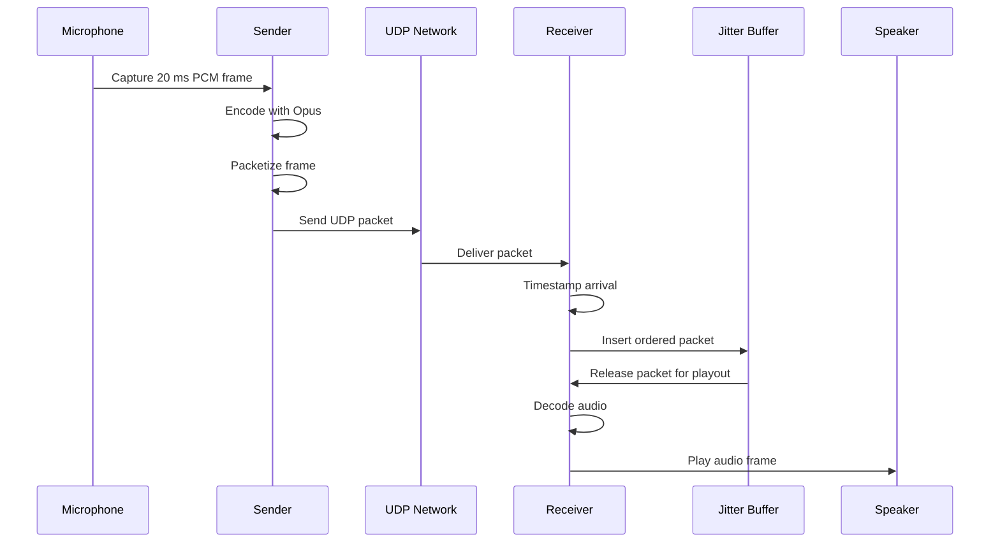
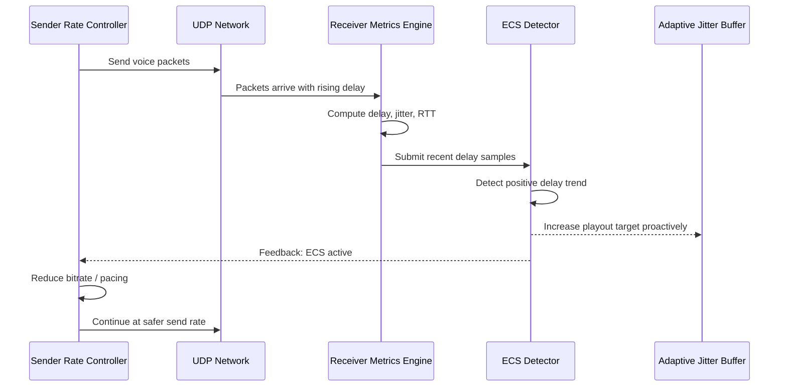
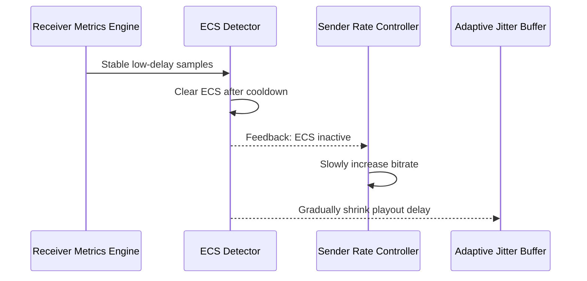
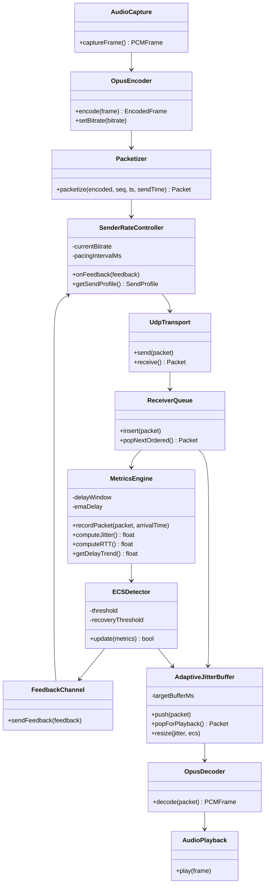
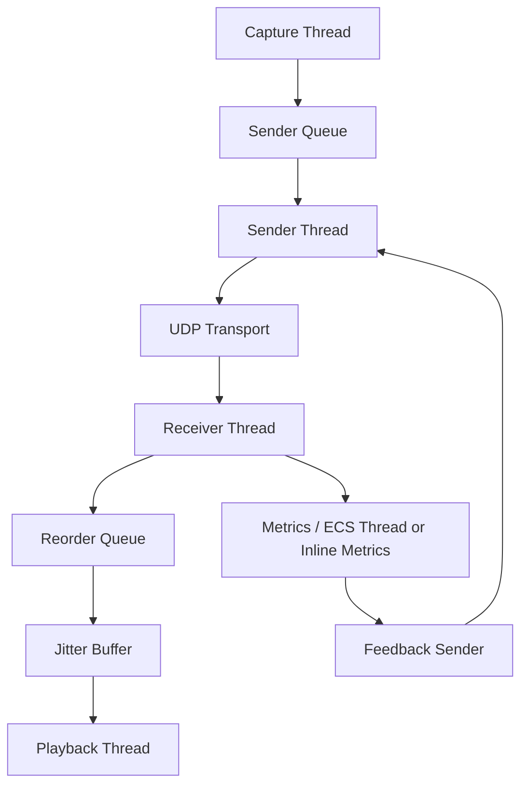

# Early Congestion Aware Low-Latency Voice Transport System

## 1. Overview

### 1.1 Purpose
This document presents the High-Level Design (HLD), Low-Level Design (LLD), and implementation plan for a low-latency voice communication system that detects congestion early, before packet loss becomes dominant, and adapts both transmission and playback behavior to preserve conversational quality.

### 1.2 Problem Statement
Modern real-time voice applications such as WhatsApp, Discord, and Zoom commonly suffer from:

- sudden voice delay increase
- robotic or broken audio
- lag spikes during unstable network conditions

These issues occur because most systems react too late. Traditional congestion control often depends on packet loss or severe jitter after the network has already degraded user experience.

### 1.3 Proposed Solution
The proposed system introduces an `Early Congestion Signal (ECS)` mechanism that analyzes delay trends at the receiver and predicts congestion buildup before packet loss becomes visible. ECS feedback is sent to the sender, which reduces transmission aggressiveness early, while the receiver proactively adjusts the jitter buffer.

### 1.4 Goals
- maintain low end-to-end latency
- detect congestion before loss-based failure
- improve conversational audio quality
- adapt sender bitrate and receiver playout delay jointly
- provide a modular platform for simulation and experimentation

---

## 2. Limitations of Existing Approaches

### 2.1 TCP
TCP is unsuitable for real-time voice because:

- retransmissions increase delay
- head-of-line blocking delays newer data
- latency becomes unstable under congestion

### 2.2 RTP over UDP
RTP-like transport over UDP is better suited for voice because it avoids retransmission delay, but it does not provide predictive congestion intelligence by itself.

### 2.3 Traditional Jitter Buffers
- static jitter buffer: stable playback but high latency
- adaptive jitter buffer: adjusts after jitter appears, not before

### 2.4 Existing Congestion Control
- TCP Reno: loss-based
- TCP Vegas: delay-based
- BBR: bandwidth-model-based

These are useful transport strategies, but they are not specifically optimized for application-level conversational voice quality.

---

## 3. High-Level Design

### 3.1 System Architecture



### 3.2 Logical Subsystems

- `Sender Subsystem`: audio capture, encoding, packetization, transmission, and rate adaptation
- `Network Subsystem`: UDP transport and controlled simulation of delay, jitter, and loss
- `Receiver Subsystem`: packet reception, metric computation, ECS generation, buffering, decoding, and playback
- `Control Subsystem`: feedback loop that carries congestion information from receiver to sender

### 3.3 End-to-End Flow

1. Audio is captured in fixed-duration frames, typically 20 ms.
2. Frames are encoded using Opus.
3. Encoded frames are packed into RTP-like UDP packets.
4. The sender transmits packets while adjusting behavior based on receiver feedback.
5. The receiver timestamps arrivals, reorders packets, and computes delay-related metrics.
6. ECS is triggered when delay trend indicates growing congestion.
7. ECS feedback is sent to the sender.
8. The receiver adapts its jitter buffer and the sender reduces transmission aggressiveness.
9. Audio is decoded and played out smoothly.

---

## 4. Sequence Diagrams

### 4.1 Normal Packet Flow



### 4.2 Early Congestion Detection and Adaptation



### 4.3 Recovery Sequence



---

## 5. Low-Level Design

### 5.1 Core Modules

#### 5.1.1 Audio Capture Module
**Responsibility**
Capture PCM audio frames from the microphone.

**Inputs**
- microphone stream

**Outputs**
- fixed-size PCM frame

**Notes**
- recommended frame duration: 20 ms
- fixed capture size simplifies timing and buffering

#### 5.1.2 Encoder Module
**Responsibility**
Compress PCM frames using Opus.

**Inputs**
- PCM frame

**Outputs**
- encoded payload

**Notes**
- bitrate controlled dynamically by sender rate controller

#### 5.1.3 Packetizer Module
**Responsibility**
Build transport packets carrying encoded audio and timing metadata.

**Packet Structure**

```c
struct Packet {
    uint32_t sequenceNumber;
    uint64_t mediaTimestamp;
    uint64_t sendTime;
    uint16_t payloadSize;
    byte[] payload;
}
```

#### 5.1.4 Sender Module
**Responsibility**
Transmit packets and react to receiver feedback.

**Core Logic**

```text
while running:
    frame = capture_audio()
    encoded = encode(frame)
    packet = packetize(encoded)
    send(packet)
    adjust_rate(feedback_state)
```

**Edge Cases**
- sudden ECS spike: immediate bitrate or pacing reduction
- no feedback: fall back to conservative defaults
- persistent congestion: clamp to minimum supported rate

#### 5.1.5 Receiver Packet Queue
**Responsibility**
Store and reorder incoming packets.

**Suggested Data Structure**
- `PriorityQueue` keyed by sequence number

#### 5.1.6 Metrics Engine
**Responsibility**
Compute:

- packet arrival delay
- RTT
- jitter
- moving averages
- recent trend windows

**Suggested Data Structures**
- sliding window
- EMA state

#### 5.1.7 ECS Detector
**Responsibility**
Detect congestion before loss by analyzing delay trends.

**Baseline Logic**

```text
window = last N delay samples
avg_old = average(first half)
avg_new = average(second half)

if avg_new - avg_old > threshold:
    ecs = true
```

**Improved Robust Logic**

```text
smoothed_delay = EMA(current_delay)
trend = smoothed_delay - previous_smoothed_delay

if trend > threshold for K consecutive packets:
    ecs = true

if trend < recovery_threshold for M consecutive packets:
    ecs = false
```

#### 5.1.8 Feedback Module
**Responsibility**
Send receiver state back to the sender.

**Feedback Structure**

```c
struct Feedback {
    bool ecsActive;
    float avgDelayMs;
    float jitterMs;
    float rttMs;
    uint32_t lastSequenceSeen;
}
```

#### 5.1.9 Rate Controller
**Responsibility**
Adjust sender behavior based on ECS and network state.

**Policy**
- ECS active: reduce bitrate or increase pacing interval quickly
- ECS inactive: recover slowly
- severe instability: remain in safe mode

#### 5.1.10 Adaptive Jitter Buffer
**Responsibility**
Balance latency and smooth playback.

**Policy**

```text
target_buffer_ms = base_buffer_ms + k * jitter_ms
```

**Behavior**
- grow fast when jitter rises or ECS is active
- shrink slowly when network stabilizes

#### 5.1.11 Decoder and Playback Module
**Responsibility**
Decode buffered frames and play them on schedule.

#### 5.1.12 Network Simulator
**Responsibility**
Emulate:

- base delay
- random jitter
- burst congestion delay
- packet loss

**Delay Model**

```text
total_delay = base_delay + random_jitter + congestion_delay
```

---

## 6. Module Diagram



---

## 7. Runtime Threading Model



### Thread Priorities
- playback thread: highest priority
- capture thread: high priority
- receiver thread: medium priority
- metrics/logging thread: lower priority

### Synchronization
- thread-safe queues between producer and consumer stages
- mutexes or lock-free structures where appropriate
- minimal locking on hot audio path

---

## 8. Data Structures and Complexity

| Module | Data Structure | Purpose | Complexity |
|---|---|---|---|
| Receiver packet queue | PriorityQueue | packet reordering | insert `O(log n)` |
| Delay tracker | Sliding window | trend observation | update `O(1)` |
| ECS smoothing | EMA state | noise reduction | update `O(1)` |
| Jitter buffer | Deque or circular buffer | playout management | enqueue/dequeue `O(1)` |

---

## 9. Networking Concepts Used

### 9.1 RTT
Round-trip time measures the time required for sender-to-receiver delivery plus feedback return.

### 9.2 Jitter
Jitter is the variation in packet arrival timing.

```text
jitter = abs(delay(n) - delay(n-1))
```

### 9.3 Packet Loss
Packet loss occurs when a sequence number is missing and the packet never arrives before playout deadline.

### 9.4 Congestion Signal Philosophy

| Algorithm | Main Trigger |
|---|---|
| TCP Reno | packet loss |
| TCP Vegas | delay |
| BBR | bandwidth model |
| ECS | rising delay trend before loss |

---

## 10. Failure Scenarios

### 10.1 Packet Burst
- queue overflow may occur
- drop oldest or expired packets first

### 10.2 Delay Spike
- ECS becomes active
- sender reduces rate
- jitter buffer grows temporarily

### 10.3 Network Collapse
- switch to minimum bitrate
- preserve continuity over fidelity

### 10.4 Feedback Loss
- sender uses last known state briefly
- then reverts to safe fallback profile

---

## 11. Logging and Observability

The system should emit structured runtime logs.

```json
{
  "timestamp": 1710000000,
  "sequence": 1250,
  "rtt_ms": 120,
  "jitter_ms": 30,
  "avg_delay_ms": 95,
  "ecs": true,
  "bitrate": 24000,
  "buffer_ms": 80
}
```

These logs support:

- debugging
- threshold tuning
- system comparison under different network conditions
- future analytics or ML experiments

---

## 12. Step-by-Step Build Plan

### Phase 1: Foundation
- implement UDP sender and receiver
- transmit synthetic packets with timestamps
- validate ordering and timing

### Phase 2: Media Path
- integrate audio capture and playback
- integrate Opus encode/decode
- implement packetizer

### Phase 3: Buffering and Reordering
- implement receiver packet queue
- implement adaptive jitter buffer
- validate playback under mild jitter

### Phase 4: Metrics and ECS
- compute delay, RTT, and jitter
- implement smoothing and sliding windows
- implement ECS detection thresholds and cooldown logic

### Phase 5: Feedback and Rate Control
- define feedback packet format
- integrate sender-side rate controller
- connect ECS state to bitrate and pacing adaptation

### Phase 6: Simulation and Evaluation
- add controllable network simulator
- test under delay, jitter, burst loss, and queue growth
- measure latency, underruns, and ECS accuracy

### Phase 7: Optimization and Visualization
- reduce allocations in hot path
- optimize queue behavior
- add a dashboard or monitoring UI if required

---

## 13. Future Enhancements

- forward error correction for moderate loss periods
- quality scoring based on perceptual voice metrics
- ML-assisted ECS threshold tuning
- support for multi-party conferencing
- experimental QUIC transport mode

---

## 14. Conclusion

This design defines a predictive congestion-aware voice transport system centered on an `Early Congestion Signal (ECS)` mechanism. By identifying delay growth before packet loss becomes dominant, the system can adapt sender behavior and receiver playout strategy early enough to improve perceived voice quality while maintaining low latency.
